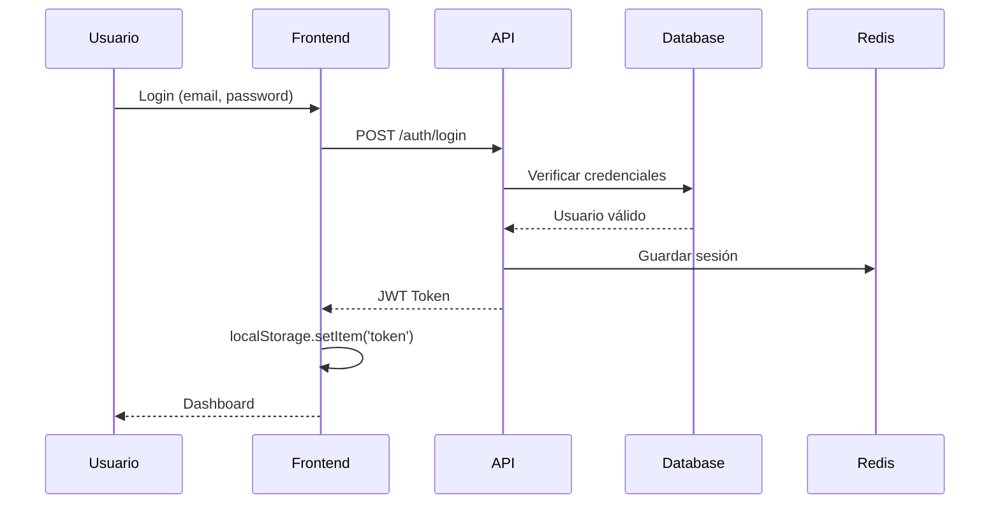
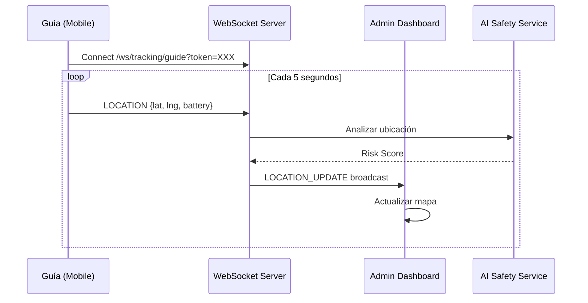
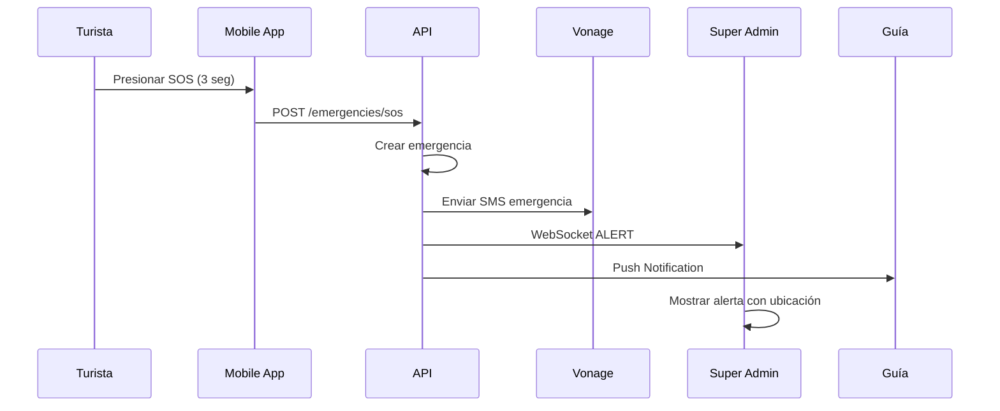

# 🏗️ Arquitectura del Sistema

## Visión General

Ruta Segura Perú utiliza una arquitectura de **microservicios monorepo** con los siguientes componentes:

```
┌─────────────────────────────────────────────────────────────────┐
│                        CLIENTES                                  │
├─────────────┬─────────────────┬─────────────────────────────────┤
│  📱 Mobile  │  🖥️ Super Admin  │  🏢 Agency Dashboard            │
│  (Expo/RN)  │  (Next.js)       │  (Next.js)                      │
└──────┬──────┴────────┬─────────┴──────────────┬─────────────────┘
       │               │                         │
       │               │ HTTPS/WSS               │
       ▼               ▼                         ▼
┌─────────────────────────────────────────────────────────────────┐
│                    🔌 API GATEWAY                                │
│                    FastAPI (Python)                              │
│                    Puerto: 8000                                  │
├─────────────────────────────────────────────────────────────────┤
│  /api/v1/auth      │ Autenticación JWT                          │
│  /api/v1/tours     │ Gestión de tours                           │
│  /api/v1/tracking  │ GPS en tiempo real                         │
│  /api/v1/emergencies│ Sistema SOS                               │
│  /api/v1/payments  │ Procesamiento Izipay                       │
│  /api/v1/verifications │ GhosCloud Deep Scan                    │
│  /ws/admin         │ WebSocket Dashboard                        │
│  /ws/tracking      │ WebSocket GPS                              │
└─────────┬───────────────────────────────────────────────────────┘
          │
          ▼
┌─────────────────────────────────────────────────────────────────┐
│                    💾 BASE DE DATOS                              │
│                    PostgreSQL + PostGIS                          │
│                    Puerto: 5432                                  │
├─────────────────────────────────────────────────────────────────┤
│  users       │ agencies    │ guides      │ tours                │
│  bookings    │ payments    │ emergencies │ verifications        │
└─────────────────────────────────────────────────────────────────┘
          │
          ▼
┌─────────────────────────────────────────────────────────────────┐
│                    🔄 CACHE & SESSIONS                           │
│                    Redis                                         │
│                    Puerto: 6379                                  │
└─────────────────────────────────────────────────────────────────┘
```

---

## Flujo de Datos

### 1. Flujo de Autenticación



### 2. Flujo de Tracking GPS en Tiempo Real



### 3. Flujo de Emergencia SOS



---

## Componentes Principales

### Backend (FastAPI)

| Directorio | Propósito |
|------------|-----------|
| `app/routers/` | Endpoints API (auth, tours, emergencies, etc.) |
| `app/models/` | Modelos SQLAlchemy (User, Tour, Agency, etc.) |
| `app/schemas/` | Schemas Pydantic para validación |
| `app/services/` | Lógica de negocio (auth_service, ghoscloud_service) |
| `app/core/` | Configuración, seguridad, dependencias |

### Frontend Apps

| App | Tecnología | Puerto | Uso |
|-----|------------|--------|-----|
| `super-admin` | Next.js 14 | 3000 | Operador central de la plataforma |
| `agency-web` | Next.js 14 | 3001 | Dashboard para agencias |
| `mobile` | Expo/React Native | 8081 | App para turistas y guías |

---

## Comunicación en Tiempo Real

El sistema usa **WebSockets** para:

1. **GPS Tracking**: Actualizaciones de ubicación cada 5 segundos
2. **Alertas SOS**: Notificación instantánea a dashboards
3. **Comandos Admin**: Envío de mensajes/alertas a usuarios

### Endpoints WebSocket

| Endpoint | Autenticación | Uso |
|----------|---------------|-----|
| `ws://localhost:8000/api/v1/ws/tracking/guide?token=JWT&tour_id=UUID` | JWT | Guía envía ubicación |
| `ws://localhost:8000/api/v1/ws/tracking/tourist?token=JWT&tour_id=UUID` | JWT | Turista envía ubicación |
| `ws://localhost:8000/api/v1/ws/admin?token=JWT` | JWT + Role | Dashboard recibe updates |

---

## Integraciones Externas

| Servicio | Propósito | Archivo Config |
|----------|-----------|----------------|
| **GhosCloud** | Verificación identidad (DNI, antecedentes) | `ghoscloud_service.py` |
| **Vonage** | SMS y llamadas de emergencia | `vonage_service.py` |
| **Izipay** | Procesamiento de pagos | `izipay.py` |
| **Firebase** | Push notifications | `firebase_service.py` |
| **Anthropic Claude** | AI Safety Analysis | `ai_safety_service.py` |

---

## Consideraciones de Seguridad

1. **JWT Tokens**: Expiración 30 min, refresh 7 días
2. **Blacklist Redis**: Tokens invalidados al logout
3. **Rate Limiting**: 60 req/min general, 5 login/min
4. **CORS**: Configurado solo para dominios permitidos
5. **Biometric Hash**: No se almacena data biométrica raw
