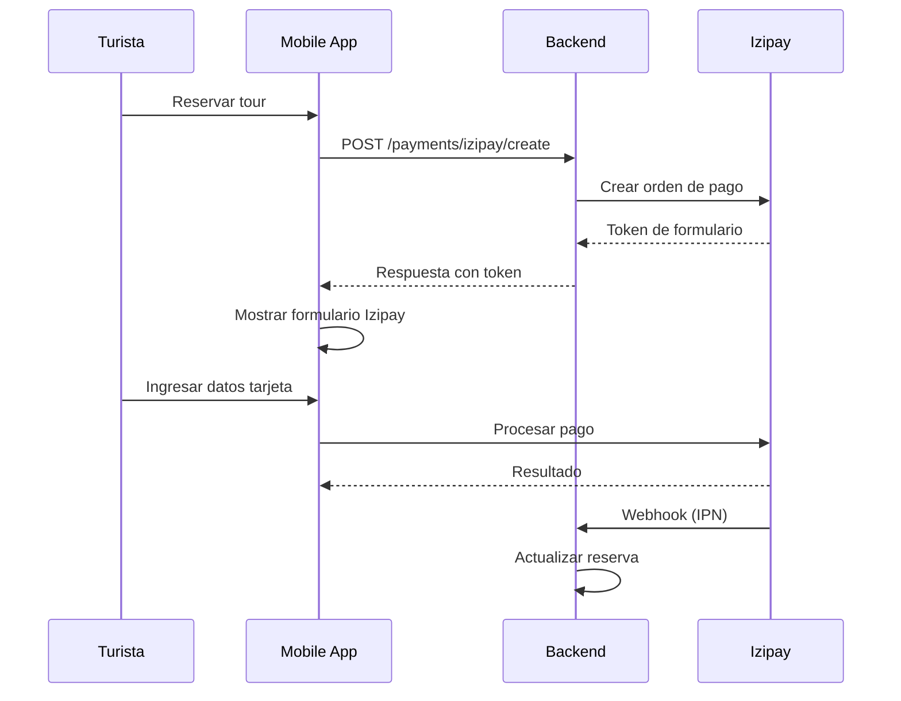

# 🔌 Integraciones Externas

## Visión General

Ruta Segura Perú integra múltiples servicios externos para proporcionar funcionalidades avanzadas.

---

## GhosCloud (Verificación de Identidad)

### Descripción
API peruana para consulta de:
- DNI (RENIEC)
- Antecedentes policiales, penales y judiciales
- Búsqueda por teléfono

### Configuración

```env
GHOSCLOUD_API_URL=https://api.ghoscloud.org/v1

# Token para DNI físico, virtual y búsqueda por nombre
GHOSCLOUD_TOKEN_DNI=tu-token-aqui

# Token para búsqueda por teléfono
GHOSCLOUD_TOKEN_PHONE=tu-token-aqui

# Token para antecedentes
GHOSCLOUD_TOKEN_BACKGROUND=tu-token-aqui
```

### Endpoints Disponibles

| Tipo | Endpoint API | Endpoint Backend |
|------|--------------|------------------|
| DNI Físico | `GET /dnivir?documento=XXX` | `POST /verifications/check-dni-physical` |
| DNI Virtual | `GET /dnive?documento=XXX` | `POST /verifications/check-dni-virtual` |
| Por Nombre | `GET /nm?documento=XXX` | `POST /verifications/check-name` |
| Por Teléfono | `GET /tel?documento=XXX` | `POST /verifications/check-phone` |
| Antecedentes | `GET /antpdf, /antpenal, /antjud` | `POST /verifications/check-background` |

### Código de Uso

```python
from app.services.ghoscloud_service import ghoscloud_service

# Verificar DNI
result = await ghoscloud_service.check_dni_physical("12345678")
# {dni, name, birth_date, address, ...}

# Verificar antecedentes completos
result = await ghoscloud_service.check_background_all("12345678")
# {
#   summary: {risk_level: "LOW", has_police_records: false, ...},
#   details: {police: {...}, penal: {...}, judicial: {...}}
# }
```

---

## Vonage (SMS y Llamadas)

### Descripción
Servicio para envío de SMS de emergencia y llamadas automatizadas.

### Configuración

```env
VONAGE_API_KEY=tu-api-key
VONAGE_API_SECRET=tu-api-secret
VONAGE_FROM_NUMBER=RutaSegura
VONAGE_WHATSAPP_NUMBER=14157386102

# Para llamadas de voz (opcional)
VONAGE_APPLICATION_ID=tu-app-id
VONAGE_PRIVATE_KEY_PATH=./vonage-private.key
```

### Uso en Emergencias

Cuando se activa un SOS:

1. Se envía SMS a contactos de emergencia del turista
2. Se envía SMS al guía del tour
3. (Opcional) Se puede hacer llamada automática

```python
from app.services.vonage_service import vonage_service

# Enviar SMS
await vonage_service.send_sms(
    to="+51999999999",
    message="🆘 EMERGENCIA: María García necesita ayuda. Ubicación: https://maps.google.com/?q=-13.5,-71.9"
)

# Enviar WhatsApp
await vonage_service.send_whatsapp(
    to="+51999999999",
    message="Alerta de emergencia..."
)
```

---

## Izipay (Pagos)

### Descripción
Gateway de pagos peruano para procesar tarjetas y billeteras digitales.

### Configuración

```env
IZIPAY_MERCHANT_CODE=tu-codigo-comercio
IZIPAY_PUBLIC_KEY=tu-llave-publica
IZIPAY_PRIVATE_KEY=tu-llave-privada
IZIPAY_ENDPOINT=https://api.micuentaweb.pe
IZIPAY_WEBHOOK_SECRET=tu-webhook-secret
```

### Flujo de Pago



### Endpoints

| Endpoint | Descripción |
|----------|-------------|
| `POST /payments/izipay/create` | Crear orden de pago |
| `POST /payments/izipay/webhook` | Recibir notificación de Izipay |
| `GET /payments/izipay/{id}/status` | Consultar estado |

---

## Firebase (Push Notifications)

### Descripción
Servicio de Google para notificaciones push a dispositivos móviles.

### Configuración

1. Crear proyecto en [Firebase Console](https://console.firebase.google.com)
2. Descargar `firebase-credentials.json`
3. Colocar en `backend/` y configurar:

```env
FIREBASE_CREDENTIALS_PATH=./firebase-credentials.json
```

### Uso

```python
from app.services.firebase_service import firebase_service

# Notificación push
await firebase_service.send_push(
    device_token="...",
    title="🚨 Alerta de Emergencia",
    body="Un turista en tu tour necesita ayuda",
    data={"emergency_id": "123", "action": "view_emergency"}
)
```

---

## Anthropic Claude (AI Safety)

### Descripción
Modelo de IA para análisis de seguridad en tiempo real.

### Configuración

```env
ANTHROPIC_API_KEY=sk-ant-api03-...
```

### Funcionalidades

1. **Análisis de Ubicación**: Evalúa riesgo basado en coordenadas
2. **Detección de Anomalías**: Velocidad inusual, batería baja
3. **Recomendaciones**: Sugiere acciones preventivas

```python
from app.services.ai_safety_service import AISafetyService

ai = AISafetyService()

analysis = await ai.analyze_situation(
    latitude=-13.5,
    longitude=-71.9,
    altitude=4500,  # Altura considerable
    battery=10,     # Batería baja
    speed=0,        # Detenido
    context="Usuario detenido en zona de altura"
)

# Resultado:
# {
#   "risk_score": 75,
#   "risk_level": "HIGH",
#   "factors": ["altitude_risk", "low_battery", "isolation"],
#   "recommendations": ["Verificar estado del usuario", "Preparar evacuación"]
# }
```

---

## Resumen de Variables de Entorno

```env
# GhosCloud
GHOSCLOUD_API_URL=https://api.ghoscloud.org/v1
GHOSCLOUD_TOKEN_DNI=xxx
GHOSCLOUD_TOKEN_PHONE=xxx
GHOSCLOUD_TOKEN_BACKGROUND=xxx

# Vonage
VONAGE_API_KEY=xxx
VONAGE_API_SECRET=xxx
VONAGE_FROM_NUMBER=RutaSegura

# Izipay
IZIPAY_MERCHANT_CODE=xxx
IZIPAY_PUBLIC_KEY=xxx
IZIPAY_PRIVATE_KEY=xxx
IZIPAY_ENDPOINT=https://api.micuentaweb.pe

# Firebase
FIREBASE_CREDENTIALS_PATH=./firebase-credentials.json

# Anthropic
ANTHROPIC_API_KEY=sk-ant-xxx
```
